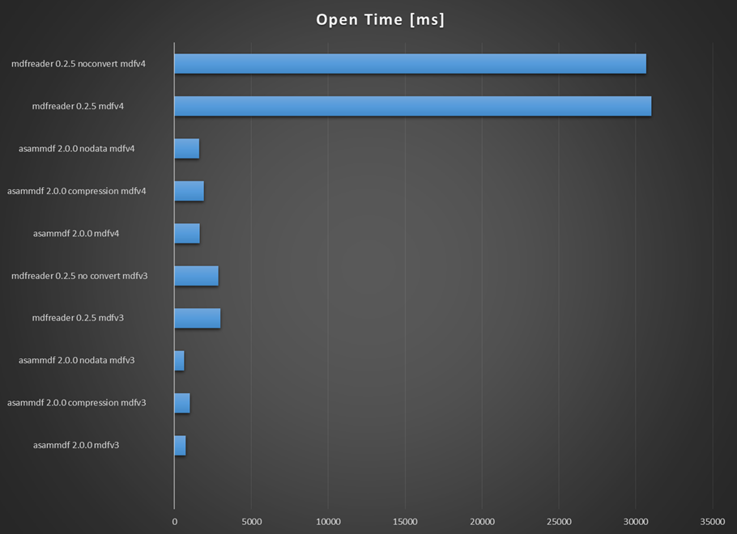
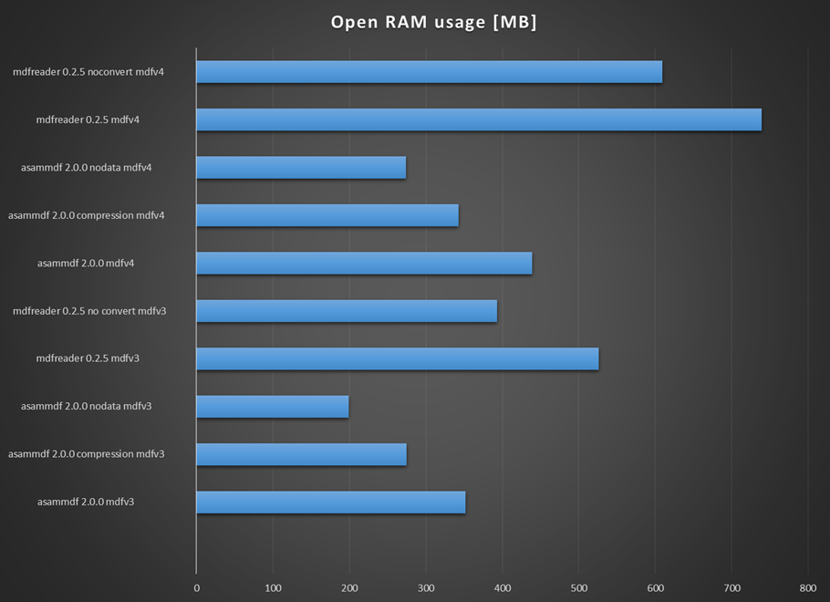
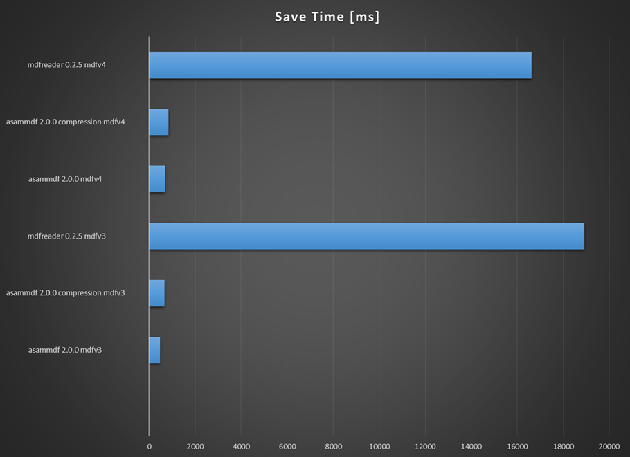

*asammdf* is a fast parser/editor for ASAM (Associtation for Standardisation of Automation and Measuring Systems) MDF (Measurement Data Format) files. 

*asammdf* supports both MDF version 3 and 4 formats. 

*asammdf* works on Python 2.7, and Python >= 3.4


Project goals
=============
The main goals for this library are:

* to be faster than the other Python based mdf libraries
* to have clean and eays to understand code base

Features
========

* read sorted and unsorted MDF v3 and v4 files
* files are loaded in RAM for fast operations

    * for low memory computers or for large data files there is the option to load only the metadata and leave the raw channel data (the samples) unread; this of course will mean slower channel data access speed

* extract channel data, master channel and extra channel information as *Signal* objects for unified operations with v3 and v4 files
* time domain operation using the *Signal* class

    * Pandas data frames are good if all the channels have the same time based
    * usually a measuremetn will have channels from different sources at different rates
    * the *Signal* class facilitates operations with such channels
    
* remove data group by index or by specifing a channel name inside the target data group
* append new channels
* convert to different mdf version

Major features still not implemented
====================================

* functionality related to sample reduction block (but the class is defined)
* mdf 3 channel dependency functionality
* functionality related to trigger blocks (but the class is defined)
* handling of unfinnished measurements (mdf 4)
* compressed data blocks for mdf >= 4.10
* mdf 4 attachment blocks
* mdf 4 channel arrays
* mdf 4 VLSD channels and SDBLOCKs
* xml schema for TXBLOCK and MDBLOCK

Usage
=====

```python
   from asammdf import MDF
   mdf = MDF('sample.mdf')
   speed = mdf.get('WheelSpeed')
 ```  
 
Check the *examples* folder for extended usage demo.

Documentation
=============
http://asammdf.readthedocs.io/en/2.0.0/

Installation
============
*asammdf* is available on 

* github: https://github.com/danielhrisca/asammdf/
* PyPI: https://pypi.org/project/asammdf/
    
```
   pip install asammdf
```
    
Dependencies
============
asammdf uses the following libraries

* numpy : the heart that makes all tick
* numexpr : for formula based channel conversions
* blosc : optionally used for in memmory raw channel data compression
* matplotlib : for Signal plotting

Benchmarks
==========









