*asammdf* is a fast parser/editor for ASAM (Associtation for Standardisation of Automation and Measuring Systems) MDF (Measurement Data Format) files. 

*asammdf* supports both MDF version 3 and 4 formats. 

*asammdf* works on Python 2.7, and Python >= 3.4


Project goals
=============
The main goals for this library are:

* to be faster than the other Python based mdf libraries
* to have clean and easy to understand code base

Features
========

* read sorted and unsorted MDF v3 and v4 files
* files are loaded in RAM for fast operations
* handle large files (exceeding the available RAM) using *load_measured_data* = *False* argument
* extract channel data, master channel and extra channel information as *Signal* objects for unified operations with v3 and v4 files
* time domain operation using the *Signal* class

    * Pandas data frames are good if all the channels have the same time based
    * usually a measuremetn will have channels from different sources at different rates
    * the *Signal* class facilitates operations with such channels
    
* remove data group by index or by specifing a channel name inside the target data group
* create new mdf files from scratch
* append new channels
* filter a subset of channels from original mdf file
* cut measurement to specified time interval
* convert to different mdf version
* export to Excel, HDF5, Matlab and CSV
* merge multiple files sharing the same internal structure
* add and extract attachments
* mdf 4.10 zipped blocks
* mdf 4 structure channels

Major features not implemented (yet)
====================================
* for version 3

    * functionality related to sample reduction block (but the class is defined)
    
* for version 4

    * handling of bus logging measurements
    * handling of unfinnished measurements (mdf 4)
    * full support mdf 4 channel arrays
    * xml schema for TXBLOCK and MDBLOCK
    * partial conversions
    * event blocks

Usage
=====

```python
   from asammdf import MDF
   mdf = MDF('sample.mdf')
   speed = mdf.get('WheelSpeed')
   speed.plot()
   
   important_signals = ['WheelSpeed', 'VehicleSpeed', 'VehicleAcceleration']
   # get short measurement with a subset of channels from 10s to 12s 
   short = mdf.filter(important_signals).cut(start=10, stop=12)
   
   # convert to version 4.10 and save to disk
   short.convert('4.10').save('important signals.mf4')
 ```  
 
Check the *examples* folder for extended usage demo.

Documentation
=============
http://asammdf.readthedocs.io/en/latest

Installation
============
*asammdf* is available on 

* github: https://github.com/danielhrisca/asammdf/
* PyPI: https://pypi.org/project/asammdf/
    
```
   pip install asammdf
```
    
Dependencies
============
asammdf uses the following libraries

* numpy : the heart that makes all tick
* numexpr : for algebraic and rational channel conversions
* matplotlib : for Signal plotting
* wheel : for installation in virtual environments

optional dependencies needed for exports

* pandas : for DataFrame export
* h5py : for HDF5 export
* xlsxwriter : for Excel export
* scipy : for Matlab .mat export

Benchmarks
==========

Python 3 x64
------------

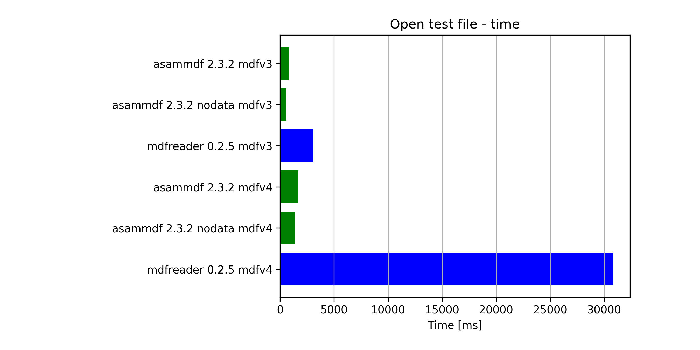

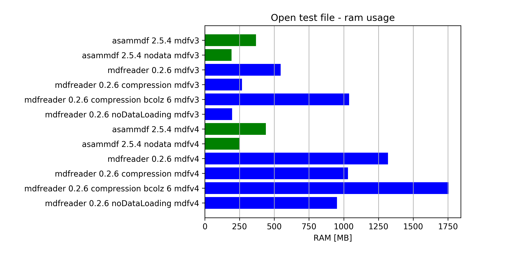

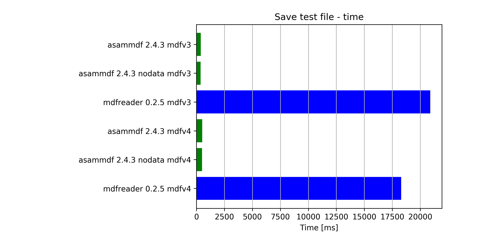

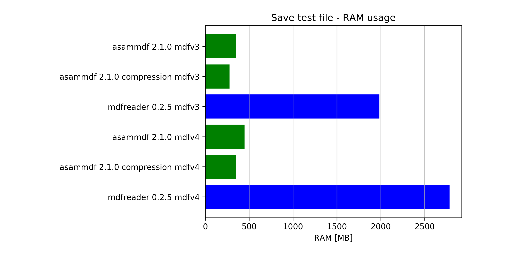

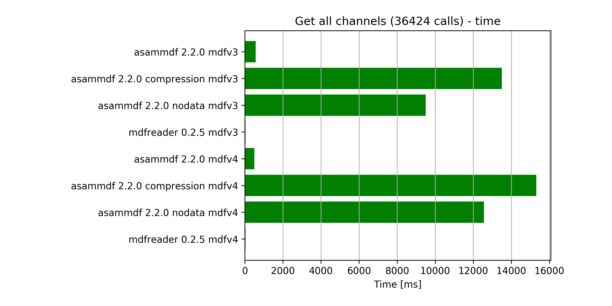

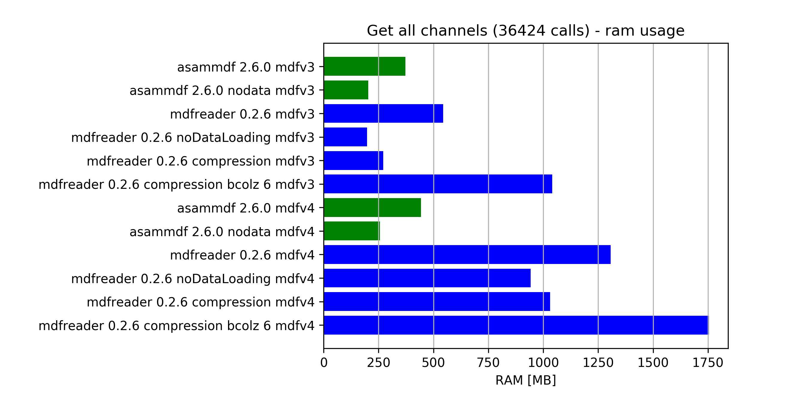


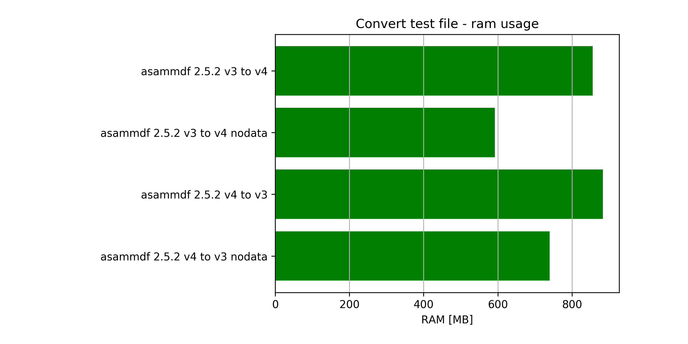

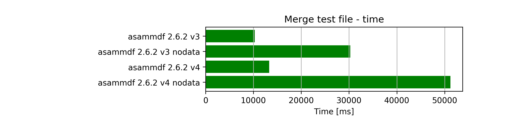

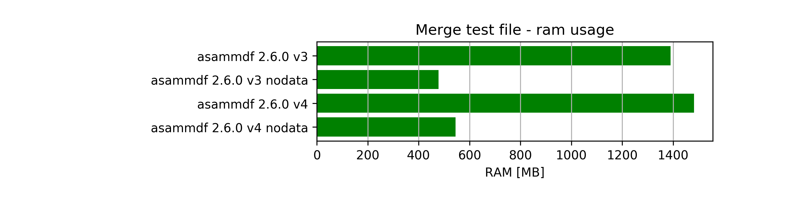

Python 3 x86
------------

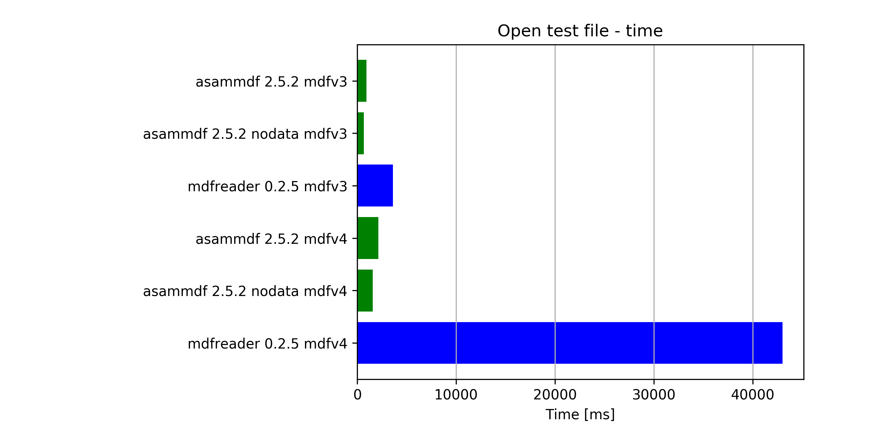

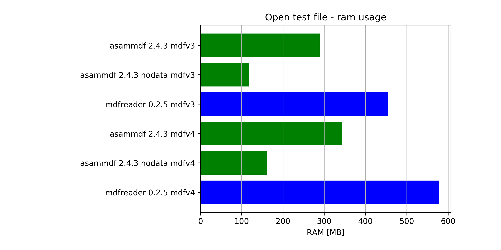

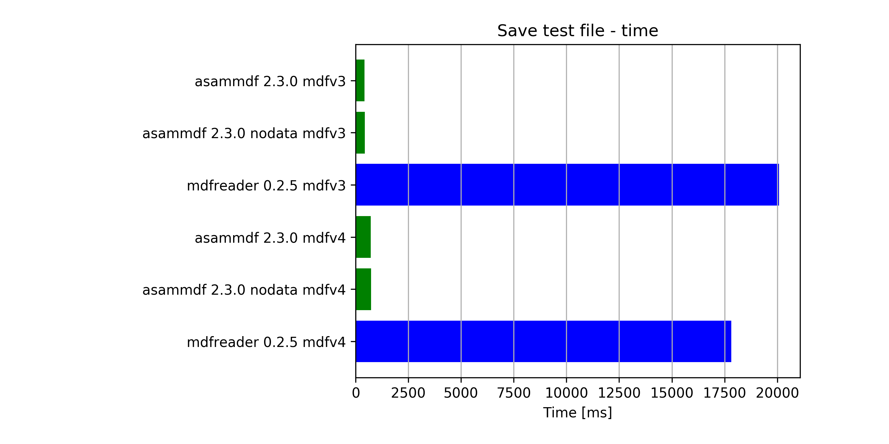

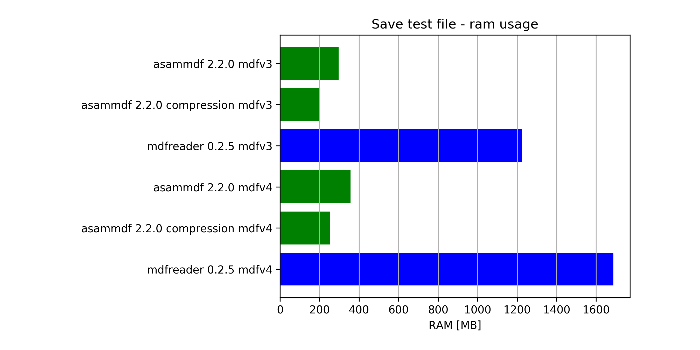

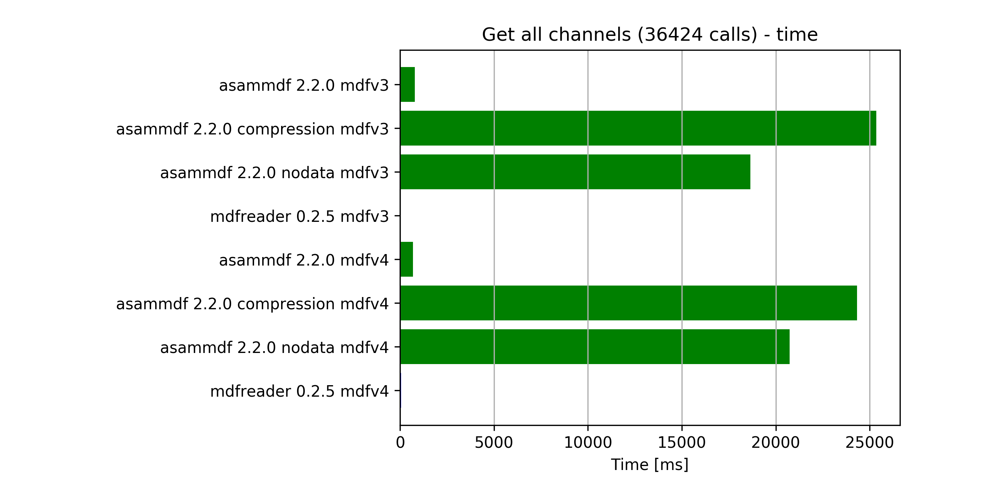

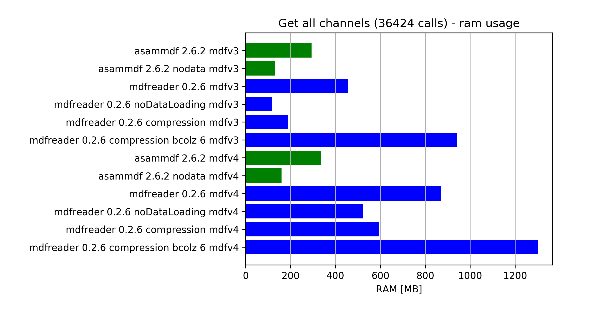

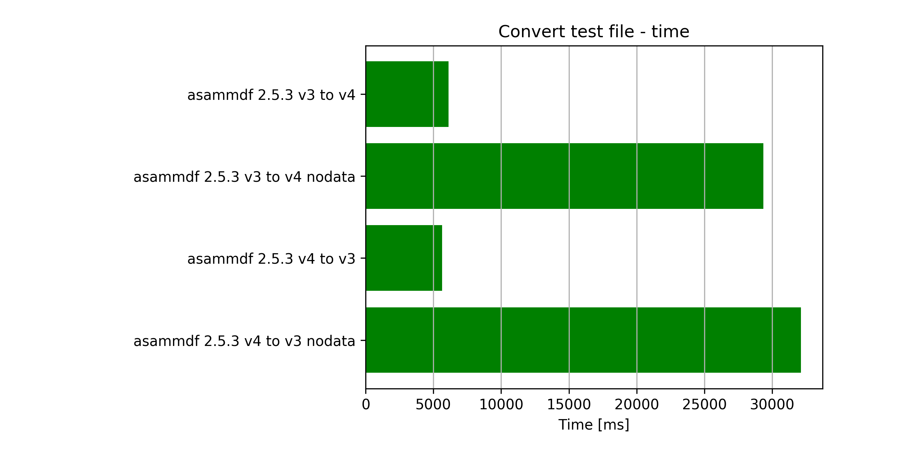

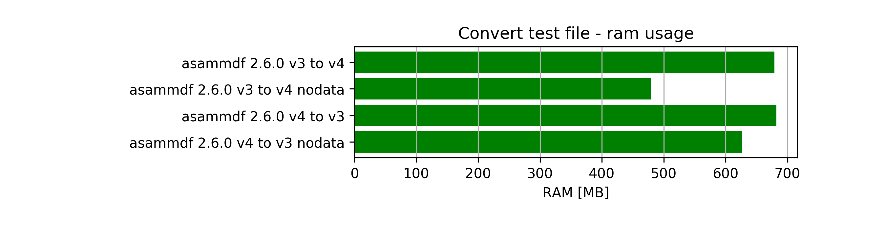

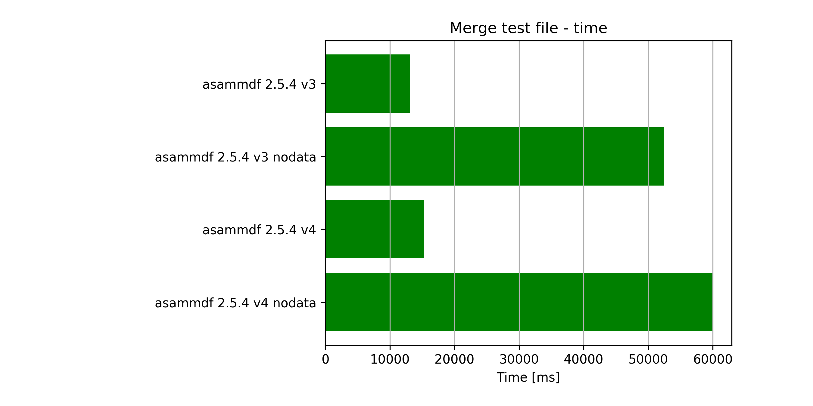

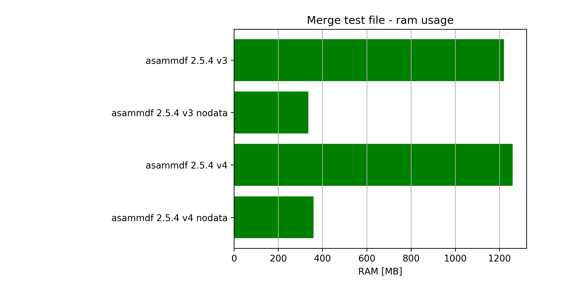
