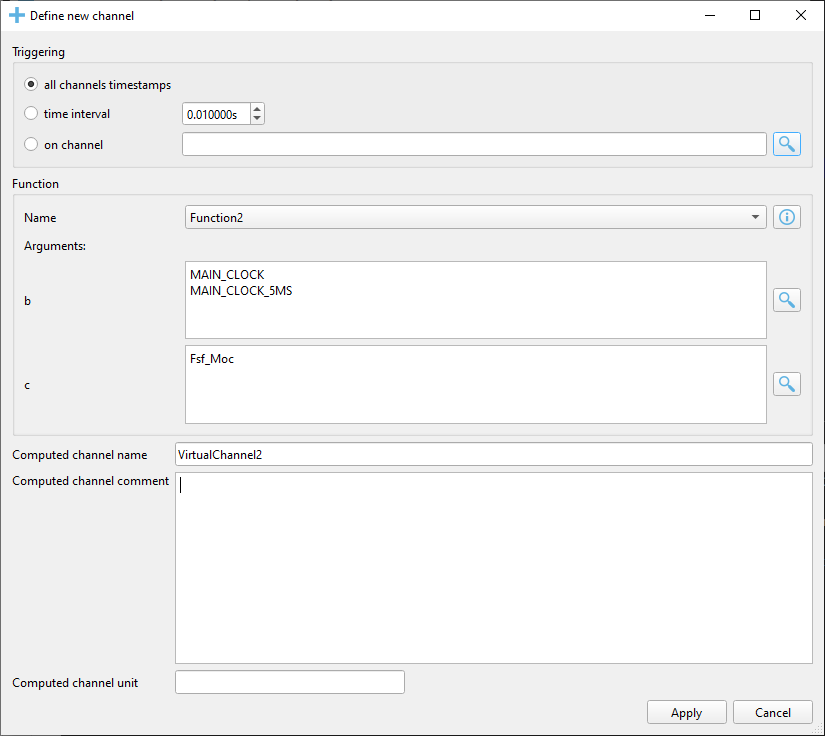

.. _Functions manager:

**********************
Functions manager view
**********************

Virtual channels (computed channels) can be defined in the Plot windows. The user will
define the functions used for the virtual channels using Python language syntax; the extra rules will be described lower. After this the user
can insert virtual channels in the Plot window (keyboard shortcut ``Ins``) and will map an existing function to the virtual channel, as well as 
a list of alternative channel names (ASAPs) for each function argument.

Function manager dialog
=======================
The user defined functions are associated with the display file. This means that there will be separate function managers for 
each opened measurement file. When a display file (.dspf) is saved by the user it will also contain the associated user defined functions.
The functions manager dialog can be invoked using the keyboard shortcut ``F6``.

.. image:: images/functions_manager_dialog.png

======================================= ================================================================================
Option                                  Description
======================================= ================================================================================
``Add``                                 Adds a new function
``Delete all``                          Deletes all the defined functions
``Load definitions``                    Imports definitions found in ``.def`` files 
``Save definitions``                    Saves all the define function to a new file with the extension ``.def``
``Function definition``                 Python language function definition
``Check syntax``                        Check if the current function definition syntax is valid
``Store function changes``              Updates the definition after the user has made changes. If this is not pressed
                                        and the user switches to another function then the changes will be lost.
``Apply``                               Accept all the changes made by the user
``Cancel``                              Rejects all the changes made by the user
======================================= ================================================================================

Python function rules
=====================
The user defines the functions using Python syntax; this means that the function definition must be valid in Python code.

Furthermore the following rules and restrictions must be followed:

    * all function arguments must have default numeric values: this means that the definition `def Function1(a, b, t=0)` is not 
      accepted, instead the user must provide default values such as `def Function1(a=1.5, b=0, t=0)`
    * the last argument must be ``t=0``: the argument `t` is reserved for the time stamp and must not be otherwise used by the user. 
      This means that the definition `def Function1(a=1.5, b=0)` is not valid, instead the user can write something like this 
      `def Function1(a=1.5, b=0, t=0)`
    * always return numeric values on all the branches: Python functions automatically return `None` if no `return` is explicitly 
      written. The user must take care that all possible code branches return numeric values.
      
      
        .. code:: python

            "this function will produce errors because not all branches have explicit return statements with numeric values"
            def Function1(a=0, t=0):
                if a > 5:
                    return 1
                  
            "this function will produce errors because it returns non-numeric values"
            def Function1(a=0, t=0):
                if a > 5:
                    return "Activated"
                else:
                    return "Disabled"
                  
            "this function is OK because it has explicit return statements with numeric values"
            def Function1(a=0, t=0):
                if a > 5:
                    return 1
                else:
                    return 0
            
            
    * the modules `math`, `pandas` and `numpy` are available inside the function as `math`, `pd` and `np`
    * functions can be cross-referenced; one function can call another user defined function
    
    
        .. code:: python
                  
          def Function1(a=0, t=0):
              if a > 5:
                  return 1
              else:
                  return 0
            
          " Function2 can call Function 1"
          def Function2(b=1, c=7, t=0):
              if b != 0:
                  return Function1(c)
              else:
                  return c / 2
      
    
Virtual channel dialog
======================
Virtual channels can be added to Plot windows using the keyboard shortcut ``Ins`` (insert). The precondition for this is to
have at least one function defined in the Functions manager.

In the `Define channel` dialog window the user can select one of the available function, and then for each of the function's 
arguments a list of alternative channel names can be filed by the user. The argument `t=0` is reserved for the time-stamp and is not
shown in the dialog window. The alternative names must be placed on separate lines in the text field found next to the argument name.

======================================= ================================================================================
Option                                  Description
======================================= ================================================================================
``Triggering``                          the virtual channel samples will be calculated in the time stamps defined by the
                                        selected choice
``Computation mode``                    the virtual channel can be computed passing the signal arguments samples by 
                                        sample or passing the signal arguments directly as numpy ndarrays
``Function name``                       select one of the available functions
``Function info``                       displays the function definition code
``Arguments``                           alternative channel names for each argument. In the example argument `b` will
                                        use the first existing ASAP from the choices `MAIN_CLOCK` or `MAIN_CLOCK_5MS`.
                                        If no alternative exist in the measurement file then the argument's default value 
                                        will be used (see the function definition)
``Argument search``                     opens a search dialog were channel names cane be searched from the measurement
                                        file
``Computed channel name``               virtual channel name
``Computed channel comment``            virtual channel comment
``Computed channel unit``               virtual channel unit
``Function definition``                 Python language function definition
``Check syntax``                        Check if the current function definition syntax is valid
``Store function changes``              Updates the definition after the user has made changes. If this is not pressed
                                        and the user switches to another function then the changes will be lost.
``Apply``                               Accept the changes and inserts the new virtual channel
``Cancel``                              Rejects all the changes made by the user
======================================= ================================================================================

When the computation mode is set to `sample by sample` the following steps are executed:

* the signals linked to the arguments are searched in the measurement file
* using the signals found in the measurement, the union of all time stamps is computed (resulting an ndarray of length N)
* all found signals are interpolated using the union time base
* the function is called N times (once for each of the N time stamps) passing the signal value for the current time stamp and the time stamp (in the `t` argument).
  The missing linked signals will be replaced by the default value specified in the function definition
* the returned value are stored and finally the resulting Signal is constructed

When the computation mode is set to `complete signal` the following steps are executed:

* the signals linked to the arguments are searched in the measurement file
* using the signals found in the measurement, the union of all time stamps is computed (resulting an ndarray of length N)
* all found signals are interpolated using the union time base
* the function is called only 1 time passing the complete signal ndarray's and the union of the time stamps (in the `t` argument).
  The missing linked signals will be replaced by an ndarray of length N filled with the default value specified in the function definition
* the result Signal is constructed using the ndarray returned by the function

Example functions
=================

Average of 3 channels
---------------------

The same definition works for both `sample by sample` and `complete signal` computation modes

.. code:: python

    def average(channel1=0, channel2=-1, channel3=0, t=0):
        return (channel1 + channel2 + channel3) / 3
        
        
Channel clipping
----------------

Using `sample by sample` computation mode

.. code:: python

    def clip(channel1=0, t=0):
        if channel1 > 100:
            return 100
        elif channe1 < 0:
            return 0
        else:
            return channel1
            

Using `complete signal` computation mode

.. code:: python

    def clip(channel1=0, t=0):
        return np.clip(cahnnel1, 0, 100)
        
            
Grey code to decimal
--------------------

The same definition works for both `sample by sample` and `complete signal` computation modes

.. code:: python 
          
    def gray2dec(position_sensor_value=0, t=0):

        for shift in (8, 4, 2, 1):
            position_sensor_value = position_sensor_value ^ (position_sensor_value >> shift)

        return position_sensor_value

            
            
Maximum of 3 channels
---------------------

Using `sample by sample` computation mode

.. code:: python

    def maximum(channel1=0, channel2=-1, channel3=0, t=0):
        return max(channel1, channel2, channel3)
        
Using `complete signal` computation mode

.. code:: python

    def maximum(channel1=0, channel2=-1, channel3=0, t=0):
        return np.maximum.reduce([channel1, channel2, channel3])
        
rpm to rad/s
------------

The same definition works for both `sample by sample` and `complete signal` computation modes

.. code:: python

    def rpm_to_rad_per_second(speed=0, t=0):
        return 2 * np.pi * speed / 60
       
       
gradient
--------

In the `Define channel` dialog the computation mode must be set to `complete signal`

.. code:: python

    def rpm_to_rad_per_second(speed=0, t=0):
        return np.diff(speed) / np.diff(t)
        
It is not possible to implement this function in the `sample by sample` mode because only the current samples are
forwarded to the function.
        
       