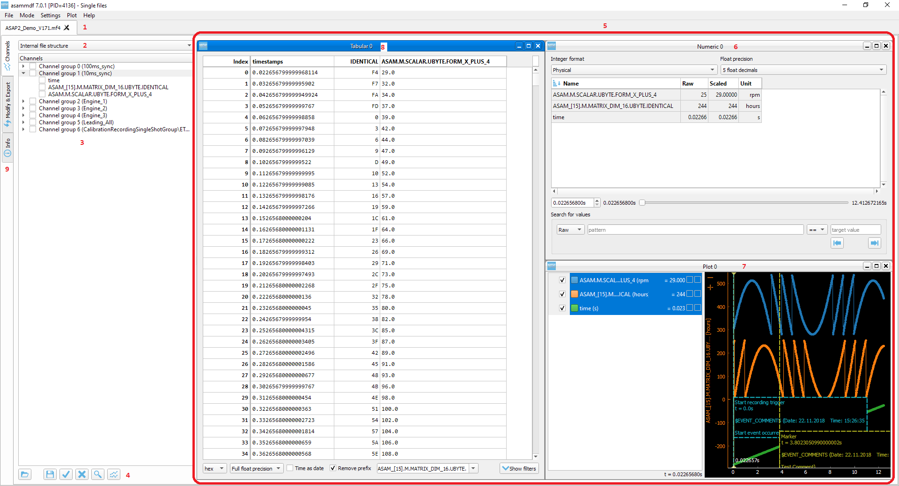
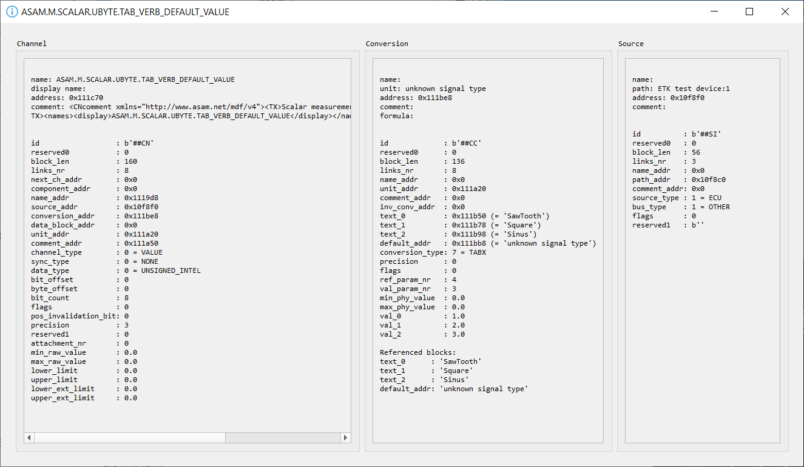
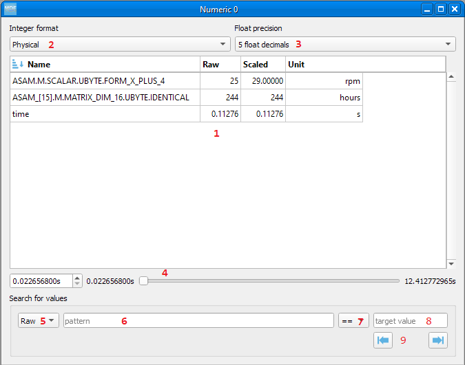
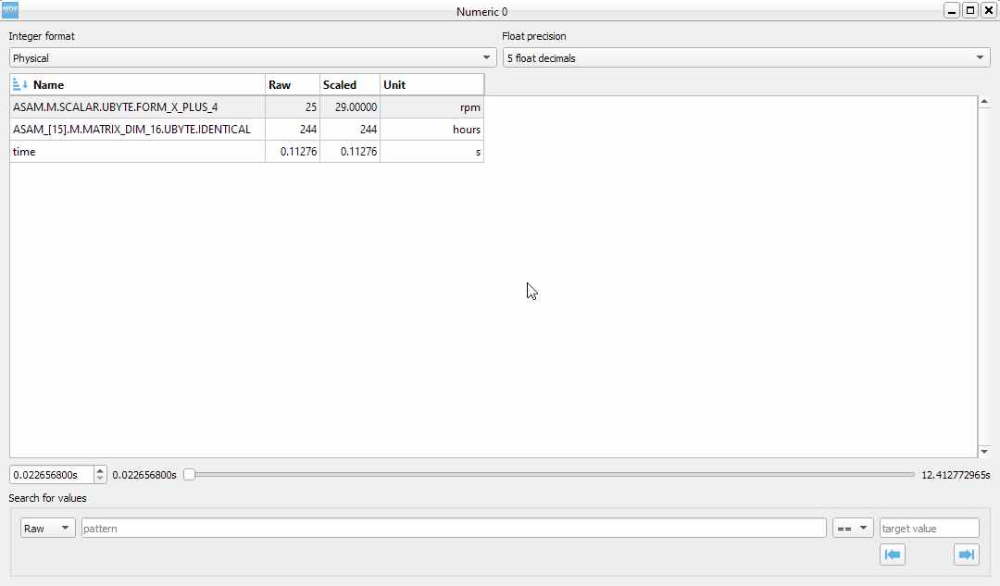
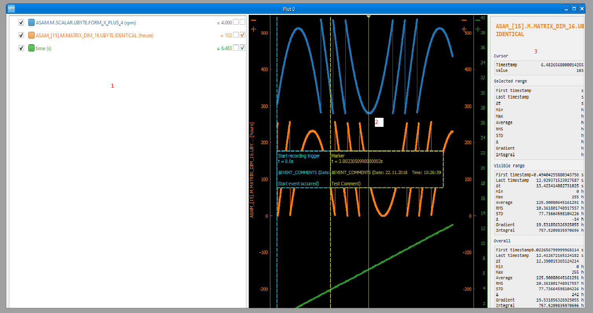
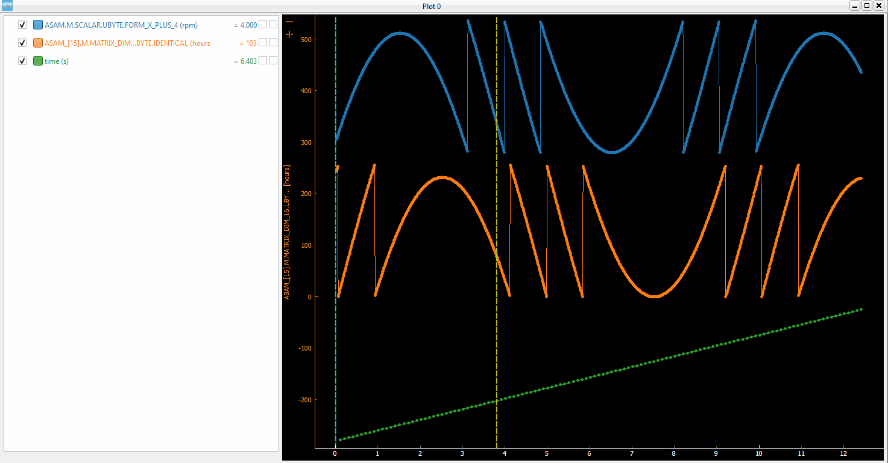
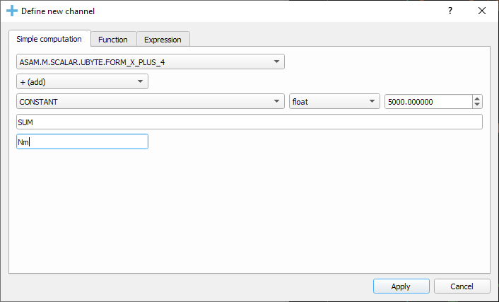
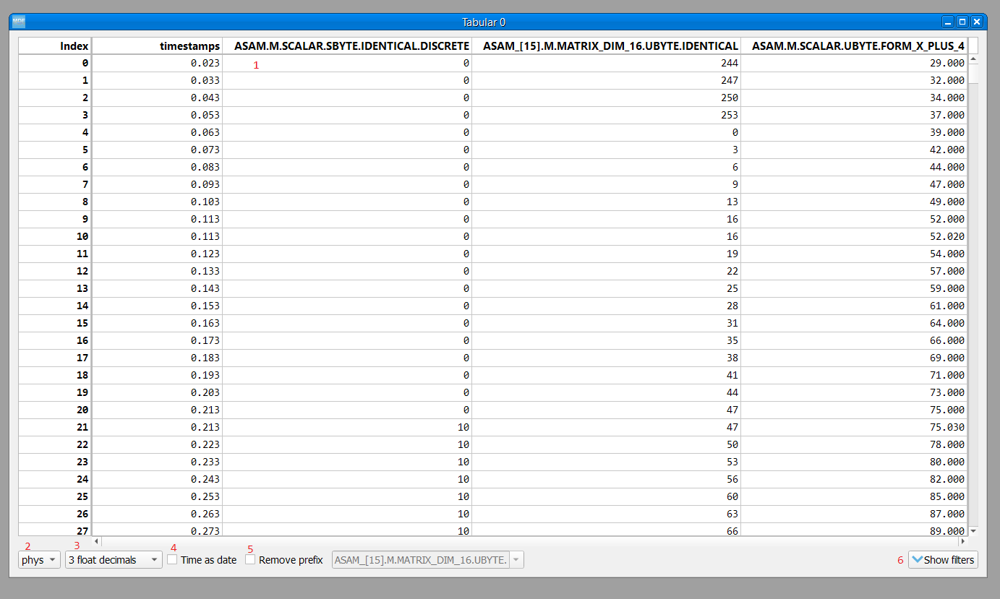
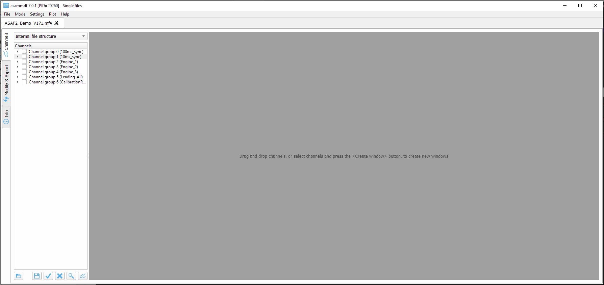
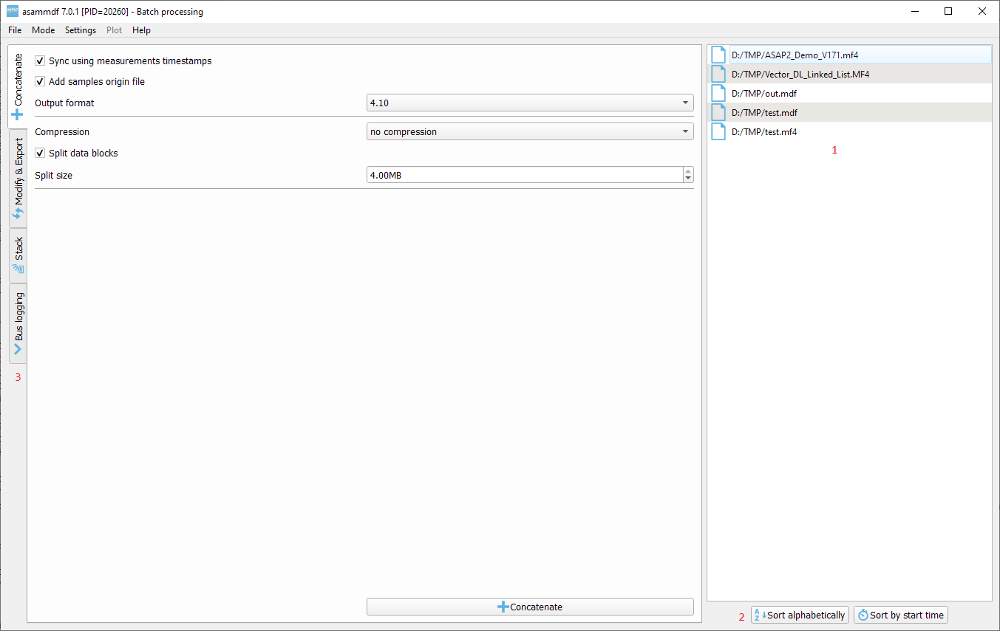

.. raw:: html

    
    
    
    
    
    
    

.. role:: red
.. role:: blue
.. role:: green
.. role:: cyan
.. role:: magenta
.. role:: orange
.. role:: brown

.. _gui:

---
GUI
---

With the GUI tool you can

* visualize channels
* compare channels from multiple files in the same plot
* see channel, conversion and source metadata as stored in the MDF file
* access library functionality for single files (convert, export, cut, filter, resample, scramble) and multiple files (concatenate, stack)

After you pip install asammdf using ``pip install asammdf[gui]`` there will be a new script called *asammdf.exe* in the `python_installation_folder\\Scripts` folder.

The following dependencies are required by the GUI

* PyQt5
* pyqtgraph

General shortcuts
=================

============ ====================== ================================================================================================================
Shortcut     Action                 Description
============ ====================== ================================================================================================================
F1           Help                   Opens this online help page
F2           Create plot            Create a new Plot window using the checked channels from the selection tree
F3           Create numeric         Create a new Numeric window using the checked channels from the selection tree
F4           Create tabular         Create a new Tabular window using the checked channels from the selection tree
F11          Toggle fullscreen      In the single files mode will display the current opened file in full screen
Ctrl+O       Open file(s)
============ ====================== ================================================================================================================

Menu
====

File
----
The first menu command is *Open*. Depending on the mode this allows to open files individually or for batch processing.

The second menu command is *Open folder*. If this is selected then, starting with the selected root folder, all sub-folders are 
searched recursively for MDF files. 

Once a file has been opened, the user can load or save a display configuration using the *Open configuration* and *Save configuration* 
menu items.

Mode
----

* *Single files* : files are opened individually
* *Batch processing* : allows processing multiple files 
* *Comparison* : show channels from all the opened files

Settings
--------

The following settings are available
      
* **Sub-windows**: controls if multiple subplots will be created when the plot button is pressed

      * ``Disabled``: a single plot is used that is overwritten 
      * ``Enabled``: a new subplot is added 
      
* **Link sub-windows X-axis**: controls the subplots are linked on the X axis (zooming will affect all sub-windows)

      * ``Disabled``
      * ``Enabled``

* **Ignore value2text conversions**: do not apply the value to text conversions

      * ``Disabled``
      * ``Enabled``
      
* **Plot background**: switch plot background color (does not affect existing plots)

      * ``Black``
      * ``White``

* **Plot X axis**: select how the X axis will be displayed

      * ``seconds``
      * ``time`` : values will be formatted as hours, minutes and seconds
      * ``date`` : the values will use the measurement start datetime
      
* **Theme**: switch application theme

      * ``Dark``
      * ``Light``
      
* **Step mode**: controls how the signal samples are interconnected visually in the Plot
      
* **Integer interpolation**: selects the way integer channels are interpolated

      * ``0 - repeat previous sample``
      * ``1 - linear interpolation``
      * ``2 - hybrid interpolation``
      
* **Float interpolation**: selects the way float channels are interpolated

      * ``0 - repeat previous sample``
      * ``1 - linear interpolation``
      
      
The settings are saved and restored each time the GUI is started.

      
Plot
----

There are several keyboard shortcuts for handling the plots:

============ ====================== ================================================================================================================
Shortcut     Action                 Description
============ ====================== ================================================================================================================
C            Edit signal color      Opens a dialog to select the signal color [7]_
F            Fit all                Y-axis fit all active channels on the screen, keeping the current X-axis range
Shift+F      Fit selected           Y-axis fit all active selected channels on the screen; unselected channels are not fitted
G            Grid                   Toggle grid lines
W            Home                   Whole signals XY-axis fit
H            Honeywell              zomm in on the current cursor position using a constant zoom level of 0.1s/cm (real display width)
I            Zoom-in                X-axis zoom-in [1]_
O            Zoom-out               X-axis zoom-out [1]_
X            Zoom to range          If the region is enabled, it will zoom to it
M            Statistics             Toggle the display of the statistic panel
R            Range                  Display a movable range that will trigger the display of the delta values for all plot channels [2]_
S            Stack all              Y Stack all active channels so that they don't overlap, keeping the X-axis range
Shift+S      Stack selected         Y Stack all active selected channels so that they don't overlap; unselected channels are not stacked
Y            Lock/unlock region     Lock or unlock the left margin of the region
.            Toggle dots            Toggle the display of signal samples (using dots affects performance)
←            Move cursor left       Moves the cursor to the next sample on the left
→            Move cursor right      Moves the cursor to the next sample on the right
Ins          Insert computation     Insert new channel in the plot using functions and operations
F11          Toggle full screen     In the single files mode will display the current opened file in full screen
Alt+I        Toggle trigger texts   Toggle the text boxes for the triggers [6]_
Alt+R        Raw samples            Toggle raw samples mode for the selected channels [6]_
Alt+S        Scaled samples         Toggle scaled (physical) samples mode for the selected channels
Ctrl+B       Bin                    Toggle binary representation of integer channels
Ctrl+H       Hex                    Toggle hex representation of integer channels
Ctrl+I       Insert cursor comment  Insert a visual vertical line and comment at the current cursor position [6]_
Ctrl+P       Physical               Toggle physical representation of integer channels
Ctrl+R       Edit color ranges      Opens a dialog to edit the channel or channel group color ranges [7]_
Ctrl+G       Edit Y axis scaling    Opens a dialog to visually edit the Y axis ranges acoording to the expected signal values [7]_
Ctrl+S       Save plot channels     Save channels from current active subplot in a new MF4 file
Ctrl+Shift+S Save all channels      Save all channels from all sub-windows in a new MF4 file
Shift+C      Cascade sub-windows    Cascade the sub plots    
Shift+Alt+F  Toggle frames          Will toggle the sub plots MDI window frames
Shift+L      Toggle channel list    Will toggle the channel tree for the current opened file
Shift+T      Tile sub-windows       Tiles sub-windows in a grid
Shift+V      Tile vertically        Tiles sub-windows vertically [3]_
Shift+H      Tile horizontally      Tiles sub-windows horizontally [3]_
Shift+←      Shift channels left    Shifts the selected channels to the left in the time domain
Shift+→      Shift channels right   Shifts the selected channels to the right in the time domain
Shift+↑      Shift channels up      Shifts the selected channels to the up
Shift+↓      Shift channels down    Shifts the selected channels to the down
============ ====================== ================================================================================================================

Single files
============
The *Single files* page is used to open several files individually for visualization and processing (for example exporting to csv or hdf5).

Layout elements
---------------

1. Opened files tabs
2. Channel tree display mode
3. Complete channels tree
4. Command buttons
5. Windows area
6. Numeric window
7. Plot window
8. Tabular window
9. File operations  

1. Opened files tabs
^^^^^^^^^^^^^^^^^^^^
In the single files mode, you can open multiple files in parallel. The tab names have the title set to the short file name, and the complete file path can be seen as 
the tab tool-tip.

There is no restriction, so the same file can be opened several times.

2. Channel tree display mode
^^^^^^^^^^^^^^^^^^^^^^^^^^^^
The channel tree can be displayed in three ways

* as a naturally sorted list
* grouped using the internal file structure
* only the selected channels

3. Complete channels tree
^^^^^^^^^^^^^^^^^^^^^^^^^
This tree contains all the channels found in the measurement. 

Double clicking a channel name will display a pop-up window with the channel information (CNBLOCK, CCBLOCK and SIBLOCK/CEBLOCK)

   
Only the channels that are checked in the channels tree will be selected for plotting when the *Create window* button is pressed.
Checking or unchecking channels will not affect the current plot or sub-windows.

4. Command buttons
^^^^^^^^^^^^^^^^^^
From left to right the buttons have the following functionality

* **Load configuration**: restores channels tree and all sub-plot windows from a saved configuration file
* **Save configuration**: saves all sub-windows (channels, colors, common axis and enable state) and channel tree
* **Select all channels**: checks all channels in the channels tree
* **Reset selection**: unchecks all channels in the channels tree
* **Advanced search & select**: will open an advanced search dialog 

      * the dialog can use wildcard and regex patterns
      * multiple channels can be selected, and thus checked in the channels tree
      * in the "Pattern based window" tab the user can define a pattern that will be used to filter out the channels from the 
        measurement file, and as a second filtering step some condition can be used based on the channels values. This information
        will be saved in the window configuration. The pattern based windows can be easily recognized by the title bar icon
      * the keyboard shortcut ``Ctrl+F`` can also be used to bring up the search dialog
     
    .. image:: images/advanced_search.png
 
* **Create window**: generates a new window (Numeric, Plot, Tabular, GPS, CAN/LIN/FlexRay Bus Trace) based on the current checked channels from the channels tree. 
  If sub-windows are disabled in the settings then the current window is replaced by the new plot. 
  If sub-windows are enabled then a new sub-plot will be added, and the already existing sub-windows will not be affected. 
  The same channel can be used in multiple sub-windows.
  

5. Windows area
^^^^^^^^^^^^^^^
If sub-windows are enabled then multiple plots can be used. The sub-windows can be re-arranged using drag & drop.

6. Numeric window
^^^^^^^^^^^^^^^^^
Numeric windows can handle a lot more channels than plot windows. You can use
a numeric window to see the channel values at certain time stamps, and to search for certain channel values.

1. display area: here we can see the instantaneous signal values. The raw and scaled values are shown for each signal.
   Double clicking a column header will toggle the sorting on that column.
2. integer format: choose between physical, hex and binary format.
3. float decimals: choose the precision used for float display
4. timestamp selection: use the input box or the slider to adjust the timestamp
5. signal values search mode: choose between raw and scaled signal samples when searching for a certain value
6. signal name pattern: use a wildcard pattern to select the signals that will be used for value searching
7. operator: operator that will be used for the search
8. target value: search target value
9. direction: timebase direction for searching the values

Double clicking a row will bring up the range editor for associated signal. 

7. Plot window
^^^^^^^^^^^^^^
Plot windows are used to graphically display the channel samples.

`pyqtgraph` is used for the plots; to get the best performance consider the following tips.

* limit the number of channels: plotting hundreds of channels can get really slow
* disabling dots will make the plots a lot more responsive

The Plot window has three section
1. signal selection tree
2. graphical area
3. signal statistics panel (toggled using the ``M`` keyboard shortcut)
   
Each signal item from the signal selection tree has five elements

1. display enable checkbox
2. color select button
3. channel name and unit label
4. channel value label [4]_     
5. common axis checkbox
6. individual axis checkbox [5]_
   

The user can also create channel groups in the selection tree. Simple channel groups are only used for grouping signals. Pattern based channel groups
can be used to filter signals based on the name or samples values.
        
The selection tree has an extended context menu accessible using the right mouse click.

Double clicking an item will open a range editor dialog, similar to the Numeric window range editor.

The initial graphics are view will have all the signal homed-in (see the *H* keyboard shortcut). The user is free to use the mouse to interact with the graphics area (zoom, pan).

The cursor is toggled using the *C* keyboard shortcut, and with it the channel values will be displayed for each item in the *Selected channels list*. 
The cursor can also be invoked by clicking the plot area.

Using the *R* keyboard shortcut will toggle the range, and with it the channel values will be displayed for each item in the *Selected channels list*. When the range is
enabled, using the *H* keyboard shortcut will not home to the whole time range, but instead will use the range time interval. 

The *Ctrl+H*, *Ctrl+B* and *Ctrl+P* keyboard shortcuts will

* change the axis values for integer channels to hex, bin or physical mode
* change the channel value display mode for each integer channel item in the *Signal selection tree*

The *Alt+R* and *Alt+S* keyboard shortcuts will switch between the raw and scaled signal samples.

Each vertical axis width can be modified using the + and - buttons.

You can insert new computed channels by pressing the *insert* key. This will allow either to compute basic operations using the plot channels, to 
apply a function on one of the plot channels, or to specify a simple expression than uses multiple signals from the Plot window.

The currently active plot's channels can be saved to a new file by pressing *Ctrl+S*.
The channels from all sub-windows can be saved to a new file by pressing *Ctrl+Shift+S*.

The sub-windows can be tiled as a grid, vertically or horizontally (see the keyboard shortcuts).

8. Tabular window
^^^^^^^^^^^^^^^^^

The tabular window is very similar to an Excel/CSV sheet.
The most powerful feature of this window is that multiple filters can be defined for the signals values.

.. image:: images/tabular2.png

The tabular window has the following elements:

1. display area: here we can see the signal values. The raw and scaled values are shown for each signal.
   Right clicking a column header will show a pop-up window for controlling the sorting, defining signal ranges and
   adjusting the columns width.
2. integer format: choose between physical, hex and binary format.
3. float decimals: choose the precision used for float display
4. timestamp format: use the input box or the slider to adjust the timestamp display as float value or as
   datetime value
5. remove prefix: remove column names prefix; avoids unnecessary large column widths
6. toggle filters view: toggle the visibility of the filters (better vertical space if filters are not used)
7. filter enable
8. filter logical relation
9. filtering signal
10. filter operator
11. target value for filtering
12. apply filters: the actual filtering is done only after pressing the button.
    The user can modify the existing filters without changing the tabular view.
13. query: the Tabular window used a pandas dataframe as backend. The filtering is
    done by performing a query on the dataframe.
    
    
9. File operations
^^^^^^^^^^^^^^^^^^
There are five aspects related to the measurement file that can be accessed using the tabs:

1. channels: here the user can visualize the signals using the available window types
2. modify & export: this tab contains the tools needed for processing the measurement file. 
   The use can filter signals, cut and resample the measurement, or export it to other file formats.
3. bus logging: this tab is only visible for the measurements that contain CAN or LIN bus logging. 
   The user can decode the raw bus logging using database files (.dbc, .ldf, .arxml)
4. attachments: this tab is only visible if the measurement contains attachments.
   The user can extract the attachment and save it to a new file.
5. info: this tab contains an overview of the measurement file content (channel groups, file header comments, total number of channels)

 

10. CAN/LIN/FlexRay Bus Trace
^^^^^^^^^^^^^^^^^^^^^^^^^^^^^
This window types can only be created by pressing the ``Create window`` button. If the measurement
does not contain bus logging of the selected kind, then no window will be generated.

The filtering and signal ranges definition is done similar to the Tabular window.

11. Drag & Drop
^^^^^^^^^^^^^^^
Channels can be dragged and dropped between sub-windows for easier configuration. Drag and drop in the free MDI can be used to create new windows.

Batch processing
================
The *Batch processing* view is used to concatenate or stack multiple files, or to perform the same processing steps on multiple files. 
Keep in mind that the order of the input files is always preserved, only the samples timestamps are influenced by the ``Sync using measurements timestamps`` checkbox.

#. file list
#. file list sorting buttons
#. batch operations

    a. concatenate requires input files with matching internal structure (same number of channel groups and the same set of channels in each n-th group). Each signal in the output file
       will be the result of concatenation of the samples from the input files
    b. modify & export: similar to the single files view
    c. stack will create a single measurement that will contain all the channel groups from the input files. Identically named channels will not be concatenated, they will just appear
       multiple times in the output file
    d. bus logging: similar to the single files view

The files list can be rearranged in the list (1) by drag and dropping lines. Unwanted files can be deleted by
selecting them and pressing the *DEL* key. The files order is considered from top to bottom. 

Comparison
==========
Use *CTRL+F* to search channels from all the opened files. The channel names are prefixed
with the measurement index.

.. rubric:: Footnotes

.. [1] If the cursor is present then zooming will center on it.
.. [2] Clicking the plot will move the left margin of the region. Pressing CTRL while clicking the plot will move the right margin of the region. 
.. [3] New in *asammdf 5.7.0*
.. [4] the value is only displayed if the cursor or range are active. For the cursor is will show the current value, and for the range it will show the value delta between the range start and stop timestamps
.. [5] New in *asammdf 5.7.0*
.. [6] New in *asammdf 5.20.0*
.. [7] New in *asammdf 7.1.0*

