.. raw:: html

    
    
    
    
    
    
    

.. role:: red
.. role:: blue
.. role:: green
.. role:: cyan
.. role:: magenta
.. role:: orange
.. role:: brown

.. _gui:

---
GUI
---

With the GUI tool you can

* visualize channels
* compare channels from multiple files in the same plot
* see channel, conversion and source metadata as stored in the MDF file
* access library functionality for single files (convert, export, cut, filter, resample, scramble) and multiple files (concatenate, stack)

After you pip install asammdf using ``pip install asammdf[gui]`` there will be a new script called *asammdf.exe* in the `python_installation_folder\\Scripts` folder.

The following dependencies are required by the GUI

* PyQt5
* pyqtgraph

Menu
====

File
----
The first menu command is *Open*. Depending on the mode this allows to open files indivisually or for batch processing.

The second menu command is *Open folder*. If this is selected then, starting with the selected root folder, all subfolders are 
searched recursively for MDF files. 

Mode
----

* *Single files* : files are opened idividually
* *Batch processing* : allows processing multiple files 
* *Comparison* : show channels from all the opened files

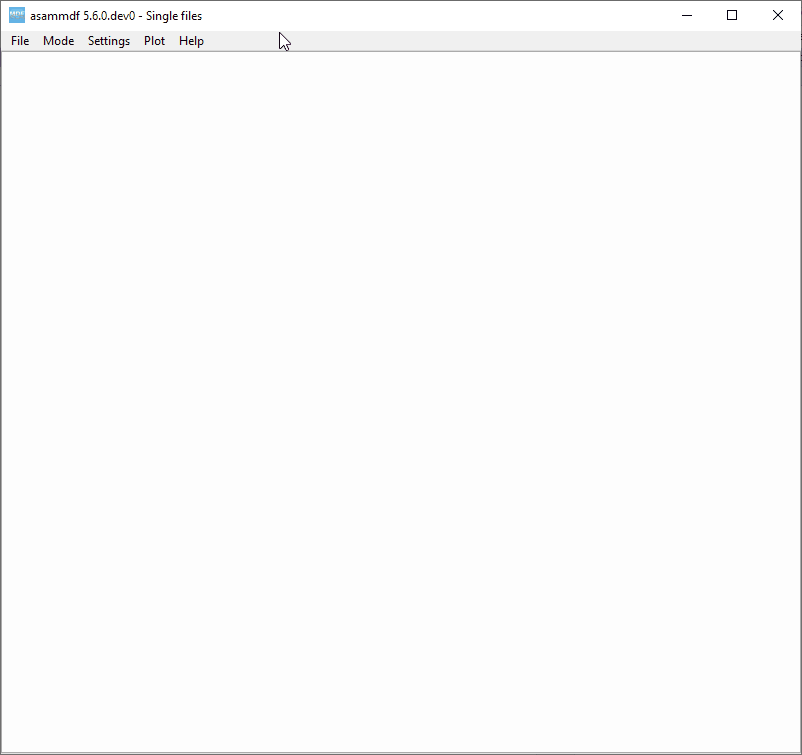

Settings
--------

The following settings are available
      
* **Search**: controls how the matching is done for the quick search field. Mathing is always done case insensitive.

      * ``Match start``: the channel name must start with the input string
      * ``Match contains``: the channel name must contain the input string
      
* **Sub-plots**: controls if multiple subplots will be created when the plot button is pressed

      * ``Disabled``: a single plot is used that is overwritten 
      * ``Enabled``: a new subplot is added 
      
* **Link sub-plots X-axis**: controls the subplots are linked on the X axis (zooming will affect all sub-plots)

      * ``Disabled``
      * ``Enabled``
      
* **Plot background**: switch plot background color (does not affect existing plots)

      * ``Black``
      * ``White``
      
* **Theme**: switch application theme (dark theme requires `qdarkstyle` package)

      * ``Dark``
      * ``Light``
      
The seetings are saved and restored each time the GUI is started.

      
Plot
----

There are several keyboard shortcuts for handling the plots:

============ ====================== ================================================================================================================
Shortcut     Action                 Desctiption
============ ====================== ================================================================================================================
C            Cursor                 Displays a movable cursor that will trigger the display of the current value for all plot channels
F            Fit                    Y-axis fit all active channels on the screen, keeping the current X-axis range
G            Grid                   Toggle grid lines
H            Home                   XY-axis fit all active channels
I            Zoom-in                X-axis zoom-in [1]_
O            Zoom-out               X-axis zoom-out [1]_
M            Statistics             Toggle the display of the statistic panel
R            Range                  Display a movable range that will trigger the display of the delta values for all plot channels [2]_
S            Stack                  Y Stack all active channels so that they don't overlap, keeping the X-axis range
Y            Lock/unlock region     Lock or unlock the left margin of the region
.            Toggle dots            toogle the display of signal samples (using dots affects performance)
←            Move cursor left       Moves the cursor to the next sample on the left
→            Move cursor right      Moves the cursor to the next sample on the right
Ins          Insert computation     Insert new channel in the plot using functions and operations
Alt+I        Toggle trigger texts   Toggle the text boxes for the triggers [6]_
Alt+R        Raw samples            Toggle raw samples mode for the selected channels [6]_
Alt+S        Scaled samples         Toggle scaled (physical) samples mode for the selected channels
Ctrl+B       Bin                    Toggle binary representation of integer channels
Ctrl+H       Hex                    Toggle hex representation of integer channels
Ctrl+I       Insert cursor comment  Insert a visual vertical line and comment at the current cursor position [6]_
Ctrl+P       Physical               Toggle physical representation of integer channels
Ctrl+S       Save plot channels     Save channels from current active subplot in a new MF4 file
Ctrl+Shift+S Save all channels      Save all channels from all sub-plots in a new MF4 file
Shift+C      Cascade sub-plots  
Shift+T      Tile sub-plots         Tiles sub-plots in a grid
Shift+V      Tile vertically        Tiles sub-plots vertically [3]_
Shift+H      Tile horizontally      Tiles sub-plots horizontally [3]_
============ ====================== ================================================================================================================

Single files
============
The *Single files* page is used to open several files individually for visualization and processing (for example exporting to csv or hdf5).

Layout elements
---------------

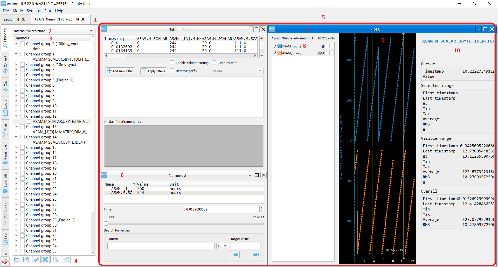

1. Opened files tabs
2. Quick channel search field for the current file
3. Channel tree display mode
4. Complete channels tree
5. Command buttons
6. Plot/Sub-plots area
7. Numeric window
8. Plot window
9. Sub-plot channel selection list
10. Sub-plot graphics area
11. Sub-plot channels statistics panel
12. File operations  

1. Opened files tabs
^^^^^^^^^^^^^^^^^^^^
In the single files mode, you can open multiple files in parallel. The tab names have the title set to the short file name, and the complete file path can be seen as 
the tab tooltip.

There is no restriction, so the same file can be opened several times.

2. Quick channel search field for the current file
^^^^^^^^^^^^^^^^^^^^^^^^^^^^^^^^^^^^^^^^^^^^^^^^^^
Using the *Settings->Search* menu option the user can choose how the search is performed. A positive search match will scroll the channels tree and highlight the channel entry.

When the same channel name exist several times in the file, you can switch between the occurrences using the arrow buttons.

3. Channel tree display mode
^^^^^^^^^^^^^^^^^^^^^^^^^^^^
The channel tree can be displayed in two ways

* as a naturally sorted list
* grouped using the internal file structure

4. Complete channels tree
^^^^^^^^^^^^^^^^^^^^^^^^^
This tree contains all the channels found in the measurement. 

Double clicking a channel name will display a pop-up window with the channel information (CNBLOCK, CCBLOCK and SIBLOCK/CEBLOCK)

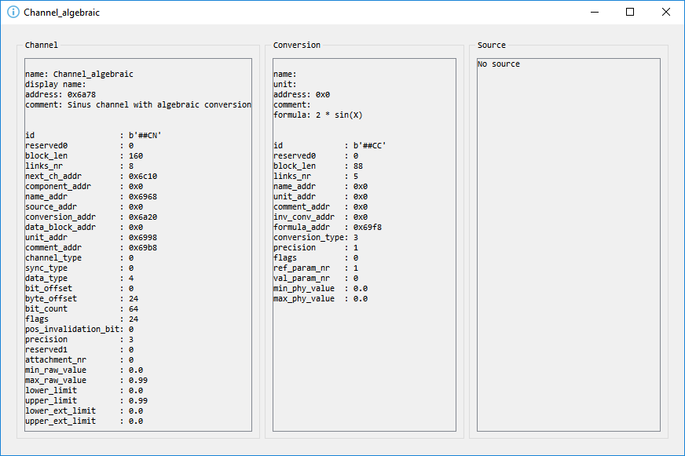
   
Only the channels that are checked in the channels tree will be selected for plotting when the *Plot* button is pressed.
Checking or unchecking channels will not affect the current plot or sub-plots.

5. Command buttons
^^^^^^^^^^^^^^^^^^
From left to right the buttons have the following functionality

* **Load configuration**: restores channels tree and all sub-plot windows from a saved configuration file
* **Save configuration**: saves all sub-plots (channels, colors, common axis and enable state) and channel tree
* **Select all channels**: checks all channels in the channels tree
* **Reset selection**: unchecks all channels in the channels tree
* **Advanced search & select**: will open an advanced search dialog 

      * the dialog can use wildcard and regex patterns
      * multiple channels can be selected, and thus checked in the channels tree
     
    .. image:: images/advanced_search.png
 
* **Plot**: generates the plot based on the current checked channels from the channels tree. If sub-plots are disabled in the settings then the current plot is replaced by the new plot. If sub-plots are enabled then a new sub-plot will be added, and the already existing sub-plots will not be affected. The channels from diffeerent sub-plots are independed from eachother (the same channel can be used in multiple sub-plots)
* **Numeric**: generates a new numeric window. The same rules apply as in the case of plot window

6. Plot/Sub-plots area
^^^^^^^^^^^^^^^^^^^^^^
If sub-plots are enabled then multiple plots can be used. The sub-plots can be re-aranged using drag & drop.

7. Numeric window
^^^^^^^^^^^^^^^^^
Numeric windows can handle a lot more channels than plot windows. You can use
a numeric window to see the channel values at certain time stamps.
The time stamps can be selected using the spin box or the slider.

8. Plot window
^^^^^^^^^^^^^^
Plot windows are used to grphically display the channel samples.
`pyqtgraph` is used for the plots; to get the best performance consider the following tips

* limit the number of channels: plotting hundreds of channels can get really slow
* disabling dots will make the plots a lot more responsive

9. Sub-plot channel selection list
^^^^^^^^^^^^^^^^^^^^^^^^^^^^^^^^^^
When the *Plot* button is pressed the checked channels will populate the *Selected channels list*.

Selecting items from the *Selected channels list* will display their Y-axis on the left side of the plot. Individual axis for each 
signal can also be toggled and they will show on the right side of the plot.

It is also necessary to select a single item when the *Statistics* panel is active to compute the statistics for the item's channel.

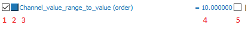
   
Each item has five elements

1. display enable checkbox
2. color select button
3. channel name and unit label
4. channel value label [4]_     
5. common axis checkbox
6. individual axis checkbox [5]_
   

.. image:: images/individual_axis.gif
        
The channel name can be copied to the clipboard using Ctrl+C.
      
Double clicking an item will open a range editor dialog

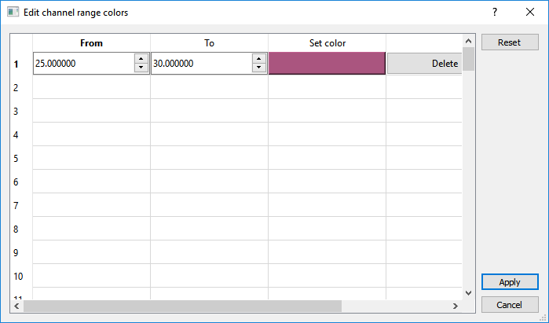
   
Here we can specify a range value visual alert. When the cursor is active and the current channel value is within the specified range, the item background will change to the
selected color.

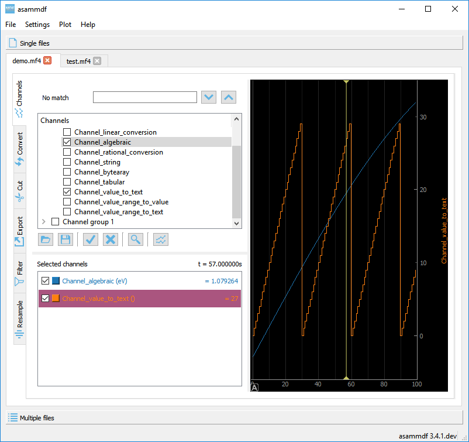

10. Sub-plot graphics area
^^^^^^^^^^^^^^^^^^^^^^^^^^
The initial plot will have all channels homed (see the *H* keyboard shortcut)

The cursor is toggled using the *C* keyboard shortcut, and with it the channel values will be displayed for each item in the *Selected channels list*. The cursor can also be invoked by clicking the plot area.

The *Ctrl+H* and *Ctrl+B* keyboard shortcuts will

* change the axis values for integer channels to hex and bin mode
* change the channel value display mode for each integer channel item in the *Selected channels list*

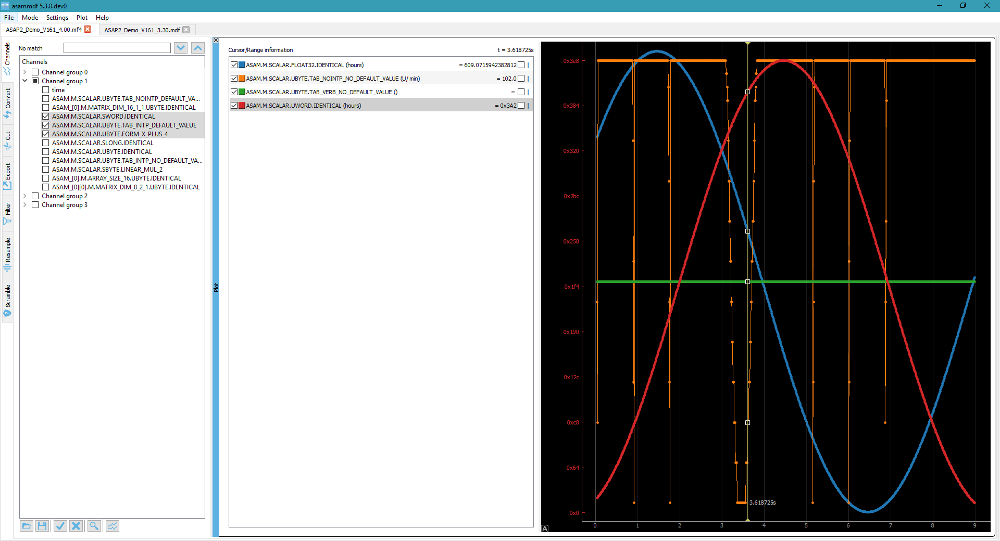
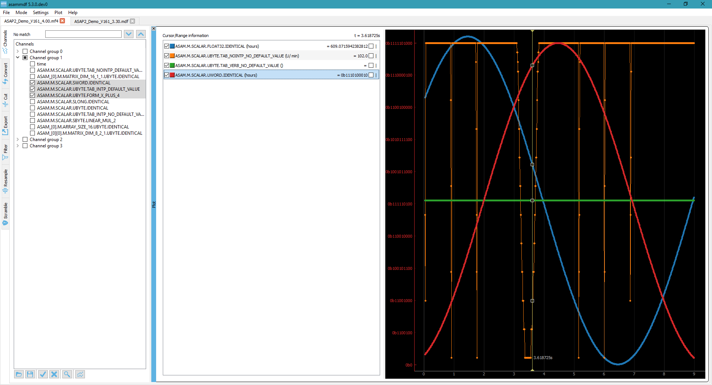

Using the *R* keyboard shortcut will toggle the range, and with it the channel values will be displayed for each item in the *Selected channels list*. When the range is
enabled, using the *H* keyboard shortcut will not home to the whole time range, but instead will use the range time interval. 

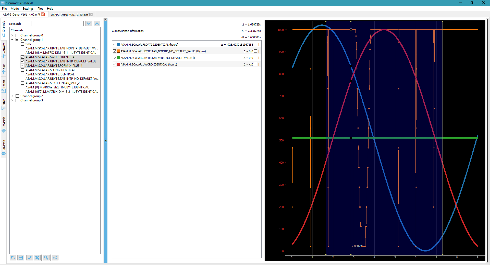

The *Statistics* panel is toggle using the *M* keyboard shortcut

You can insert new computed channels by pressing the *insert* key. This will allow either to compute basic operations using the plot channels, or to 
apply a function on one of the plot channels.

.. image:: images/compute_channel_dialog.png

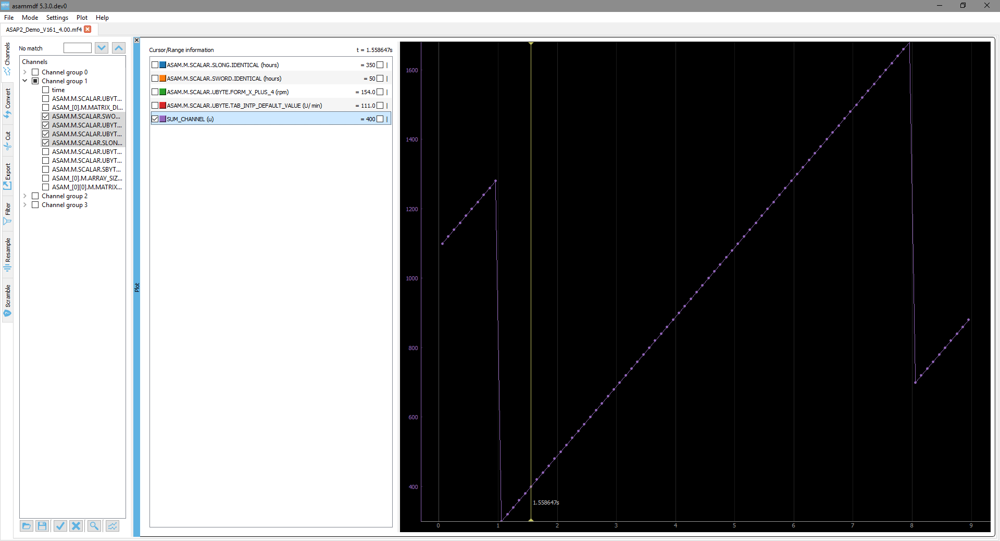

The currently active plot's channels can be saved to a new file by pressing *Ctrl+S*.
The channels from all sub-plots can be saved to a new file by pressing *Ctrl+Shift+S*.

The sub-plots can be tiled as a grid, vertically or horizontally

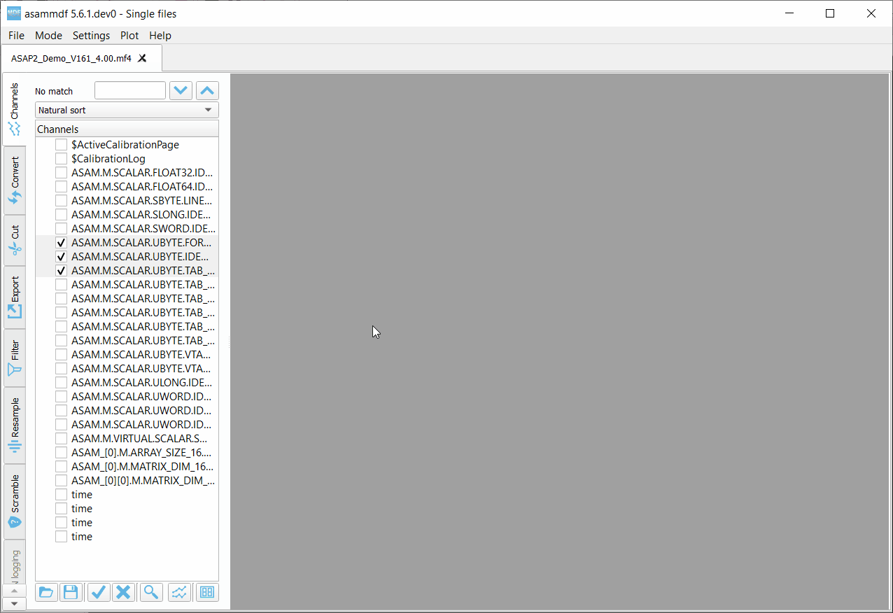

Drag & Drop
-----------
Channels can be draged and dropped between sub-plots for easier configuration.

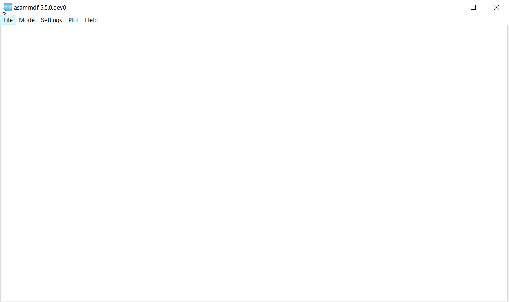

Multiple files
==============
The *Multiple files* toolbox page is used to concatenate or stack multiple files. 

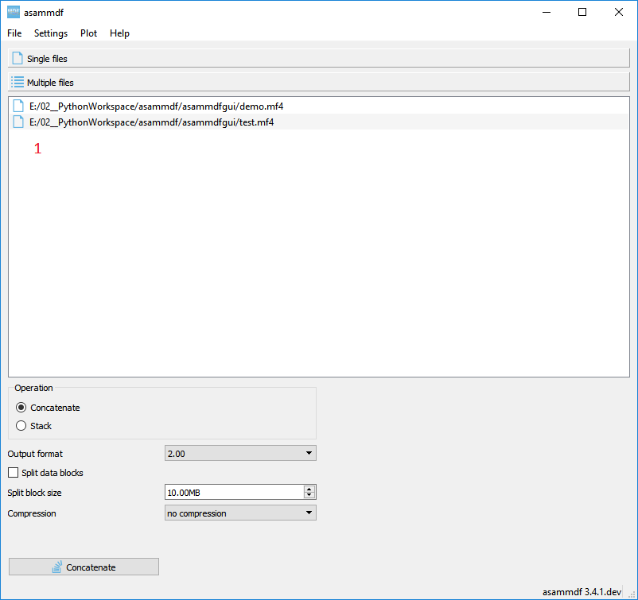

The files list can be rearranged in the list (1) by drag and dropping lines. Unwanted files can be deleted by
selecting them and pressing the *DEL* key. The files order is considered from top to bottom. 

Comparison
==========
Use *CTRL+F* to search channels from all the opened files. The channel names are prefixed
with the measurement index.

.. rubric:: Footnotes

.. [1] If the cursor is present then zooming will center on it.
.. [2] Clicking the plot will move the left margin of the region. Pressing CTRL while clicking the plot will move the right margin of the region. 
.. [3] New in *asammdf 5.7.0*
.. [4] the value is only displayed if the cursor or range are active. For the cursor is will show the current value, and for the range it will show the value delta between the range start and stop timestamps
.. [5] New in *asammdf 5.7.0*
.. [6] New in *asammdf 5.20.0*

