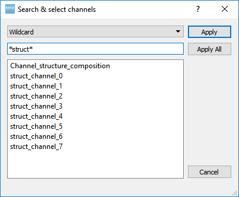
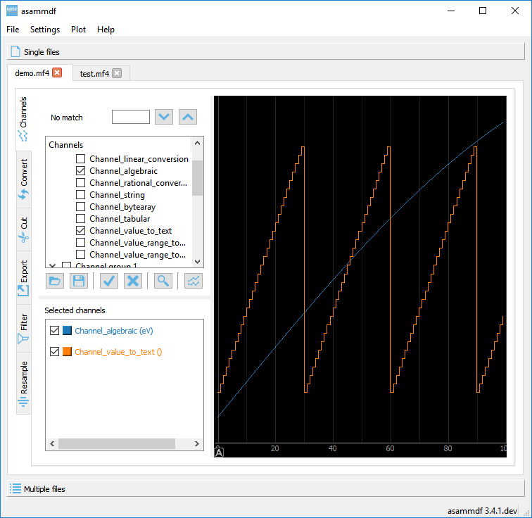
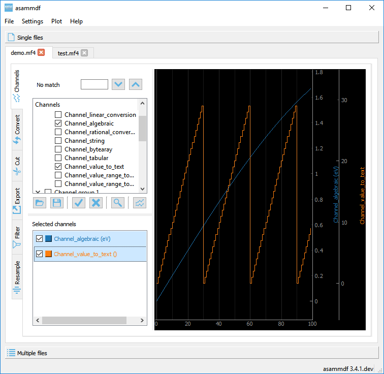
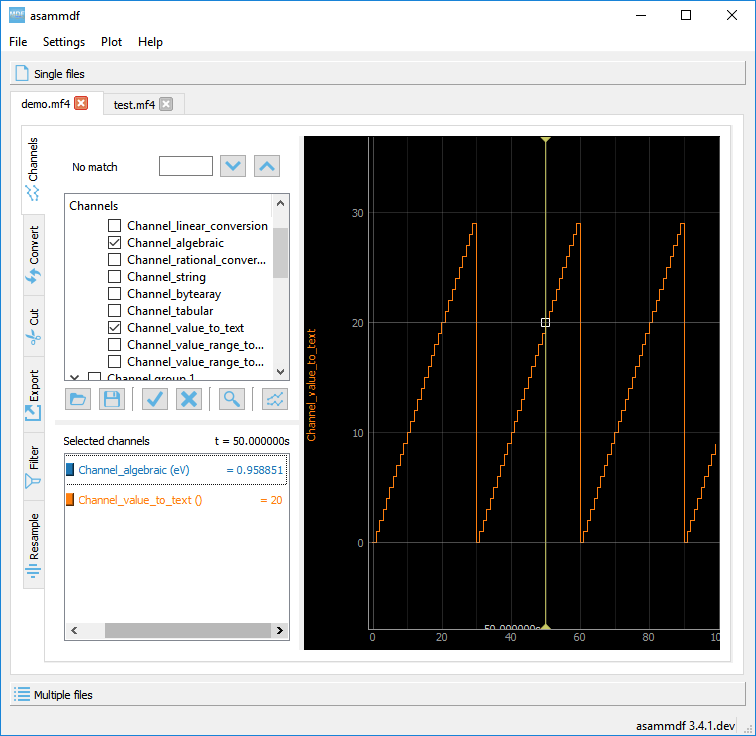
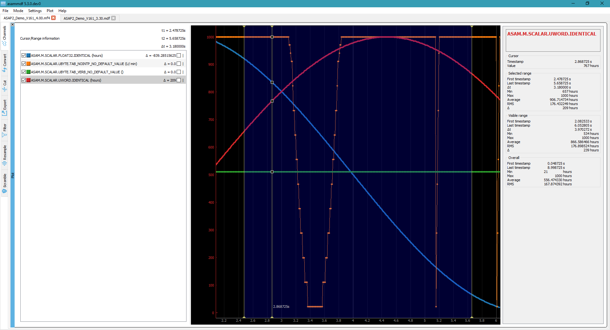

.. raw:: html

    
    
    
    
    
    
    

.. role:: red
.. role:: blue
.. role:: green
.. role:: cyan
.. role:: magenta
.. role:: orange
.. role:: brown

.. _gui:

---
GUI
---

With the GUI tool you can

* visualize channels
* see channel, conversion and source metadata as stored in the MDF file
* access library functionality for single files (convert, export, cut, filter, resample) and multiple files (concatenate, stack)

After you pip install asammdf there will be a new script called *asammdf.exe* in the `python_installation_folder\\Scripts` folder.

The following dependencies are required by the GUI

* PyQt5
* pyqtgraph

Menu
====

File
----
The only command here is *Open*. Depending on the page this is allow to open a single file, or multiple files.

Settings
--------

The following settings are available

* **Plot lines**: controls the visual style of the channels plot lines:

      * ``Simple``: a simple line is used to join the channel samples. It is the default option because it gives the best performance for high sample count
      * ``With dots``: a simple line joins the channels sample, and the actual samples are marked by a dot. This allows for better visualization, but at the
        expense of lower performance
      
* **Search**: controls how the matching is done for the quick search field. Mathing is always done case insensitive.

      * ``Match start``: the channel name must start with the input string
      * ``Match contains``: the channel name must contain the input string
      
      
Plot
----

There are several keyboard shortcuts for handling the plots:

======== ================== ================================================================================================================
Shortcut Action             Desctiption
======== ================== ================================================================================================================
C        Cursor             Displays a movable cursor that will trigger the display of the current value for all plot channels
F        Fit                Y-axis fit all active channels on the screen, keeping the current X-axis range
G        Grid               Toggle grid lines
H        Home               XY-axis fit all active channels
I        Zoom-in            X-axis zoom-in [#f1]_
O        Zoom-out           X-axis zoom-out [#f1]_
M        Statistics         Toggle the display of the statistic panel
R        Range              Display a movable range that will trigger the display of the delta values for all plot channels
S        Stack              Y Stack all active channels so that they don't overlap, keeping the X-axis range
←        Move cursor left   Moves the cursor to the next sample on the left
→        Move cursor right  Moves the cursor to the next sample on the right
Ins      Insert computation Insert new channel in the plot using functions and operations
Ctrl+B   Bin                Toggle binary representation of integer channels
Ctrl+H   Hex                Toggle hex representation of integer channels
Ctrl+P   Physical           Toggle physical representation of integer channels
Ctrl+S   Save plot channels Save all plotted channel in a new MF4 file
======== ================== ================================================================================================================

.. rubric:: Footnotes

.. [#f1] If the cursor is present then zooming will center on it.

Single files
============
The *Single files* page is used to open several files individually for visualization and processing (for example exporting to csv or hdf5).

.. image:: images/single_files.png

1. Single files page selector
2. Multiple files page selector
3. Opened files tabs
4. Quick channel search field for the current file
5. Complete channels tree
6. Command buttons
7. Selected channels list
8. Current file operations tabs  

Opened files tabs
-----------------
In the single files mode, you can open multiple files in parallel. The tab names have the title set to the short file name, and the complete file path can be seen as 
the tab tooltip.

There is no restriction, so the same file can be opened several times.

Quick channel search field for the current file
-----------------------------------------------
Using the *Settings->Search* menu option the user can choose how the search is performed. A positive search match will scroll the channels tree and highlight the channel entry.

When the same channel name exist several times in the file, you can switch between the occurrences using the arrow buttons.

Complete channels tree
----------------------
This tree contains all the channels found in the measurement. 

Double clicking a channel name will display a pop-up window with the channel information (CNBLOCK, CCBLOCK and SIBLOCK/CEBLOCK)

.. image:: images/channel_info.png
   
Only the channels that are checked in the channels tree will be selected for plotting when the *Plot* button is pressed.
Checking or unchecking channels will not affect the current plot.

Command buttons
---------------
From left to right the buttons have the following functionality

* **Load channel selection list**: loads a channel selection list from a text file (one channel name per line) and checks them in the channels tree is they are found.
* **Save channel selection list**: saves the current checked channels names in a text file
* **Select all channels**: checks all channels in the channels tree
* **Reset selection**: unchecks all channels in the channels tree
* **Advanced search & select**: will open an advanced search dialog 

      * the dialog can use wildcard and regex patterns
      * multiple channels can be selected, and thus checked in the channels tree
     

 
* **Plot**: generates the plot based on the current checked channels from the channels tree

Selected channels list
----------------------
When the *Plot* button is pressed the checked channels will populate the *Selected channels list*.

Selecting items from the *Selected channels list* will display their Y-axis on the right side of the plot, if the items are enabled for display. 

It also necessary to select a single item when the *Statistics* panel is active to compute the statistics for the item's channel.

.. image:: images/display_list.png
   
Each item has five elements

1. display enable checkbox
2. color select button
3. channel name and unit label
4. channel value label 
5. common axis checkbox

    * the value is only displayed if the cursor or range are active. For the cursor is will show the current value, and for the range it will
      show the value delta between the range start and stop timestamps
      
Double clicking an item will open a range editor dialog

.. image:: images/range_editor.png
   
Here we can specify a range value visual alert. When the cursor is active and the current channel value is within the specified range, the item background will change to the
selected color.

.. image:: images/range_visual_alert.png

Plot
----
The initial plot will have all channels homed (see the *H* keyboard shortcut) and Y-axis disabled

Selecting items from the *Selected channels list* will enable the Y-axis

Using the *C* keyboard shortcut will toggle the cursor, and with it the channel values will be displayed for each item in the *Selected channels list*

The *Ctrl+H* and *Ctrl+B* keyboard shortcuts will

* change the axis values for integer channels to hex and bin mode
* change the channel value display mode for each integer channel item in the *Selected channels list*

.. image:: images/cursor_hex.png
.. image:: images/cursor_bin.png

Using the *R* keyboard shortcut will toggle the range, and with it the channel values will be displayed for each item in the *Selected channels list*. When the range is
enabled, using the *H* keyboard shortcut will not home to the whole time range, but instead will use the range time interval. 

.. image:: images/range.png

The *Statistics* panel is toggle using the *M* keyboard shortcut

You can insert new computed channels by pressing the *insert* key. This will allow either to compute basic operations using the plot channels, or to 
apply a function on one of the plot channels.

The plot channels can be saved to a new file by pressing *Ctrl+S*.

Multiple files
==============
The *Multiple files* toolbox page is used to concatenate or stack multiple files. 

.. image:: images/multiple_files.png

The files list can be rearranged in the list (1) by drag and dropping lines. Unwanted files can be deleted by
selecting them and pressing the *DEL* key. The files order is considered from top to bottom. 

